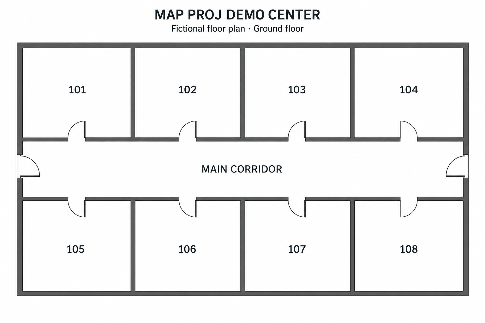

# Create your first room in MapProj

## 1. Upload the demo building

Start MapProj using the README instructions and sign in as `admin` with the password printed on first startup. If you explicitly enabled demo mode before first startup, use `admin123`.

Click **+ Add Building**, name it **Demo Center**, and upload [`demo-floor-plan.png`](../examples/demo-floor-plan.png). Select the building if it is not selected automatically.

The release already includes the configured demo as **Building1**. Select it to try statuses immediately. To practice tracing from scratch, use **Practice Building** as the new building name instead.

**Screenshot point:** capture the uploaded floor plan before any rooms are traced.

## 2. Trace room 101

Under **Rooms**, click **Enter Calibration**. In **Manual Calibration**, enter `101` as the room number.

Click each of the four inside corners of the top-left room in order: top-left, top-right, bottom-right, bottom-left. Trace the room interior; for this simple demonstration, continue the bottom edge straight across the doorway. Do not click the first corner twice.

Click **Complete Polygon**. MapProj needs at least three nodes; this rectangular room uses four.

**Screenshot point:** capture the outline with four nodes and the calibration panel visible before saving.

## 3. Save the room

The image already has room numbers printed on it, so uncheck **Show room number** to avoid a duplicate number overlay. Click **Save Room**, then dismiss the saved-room message.

Repeat for rooms `102` through `108`, using a unique number each time. Click **Exit** when finished.

**Screenshot point:** capture a saved room and its entry in the Rooms list.

## 4. Demonstrate room statuses

Choose a status from the legend and click a traced room. Use different statuses on a few rooms to show how MapProj tracks progress. Use the mouse wheel to zoom and the middle mouse button to pan.

**Screenshot point:** capture the map with several rooms marked and the legend visible. This is a useful lead image for GitHub.

## Screenshot checklist

- Use only the fictional demo building.
- Capture the map and relevant controls at a readable browser size.
- Save images in `docs/images/` and link them from this guide or the README.
- Suggested filenames: `01-uploaded-plan.png`, `02-trace-room.png`, `03-saved-room.png`, and `04-room-statuses.png`.

The image above is the fictional upload template. Follow the screenshot points to capture the app with your own traced rooms.
